## Exploring this test dataset

During class we will discuss and identify some of the issues with this dataset - click on link to download the data in CSV (comma separated format) format [Dataset_02_fixq2.csv](https://github.com/melindahiggins2000/N736Homework01/raw/master/Dataset_02_fixq2.csv).

NOTE: CSV files are basically TEXT files where each value is entered on rows separated by columns. Each column is assumed to be a different VARIABLE (a different FIELD). Each row is assumed to be a different RECORD - think of a patient's medical file/folder.

## Project Organization

1. Create a folder on your computer for this project. For example "C:\\N736\\exercise01". Click on New Folder and type in the name of the folder you want. Repeat to create the subfolders.

**NOTE**: On Windows the folder separator is the left-tilt "back-slash" \\. However on a MAC the folder separator is the right-tilt "forward-slash" /. Be sure to check how these folder paths need to be input for (A) your operating system and (B) software. For example, I am on a Windows operating system which expects "\\", but when I am using `R` I have to type my folder paths using the "/".

#### Create Folder - using File Explorer on Windows operating system

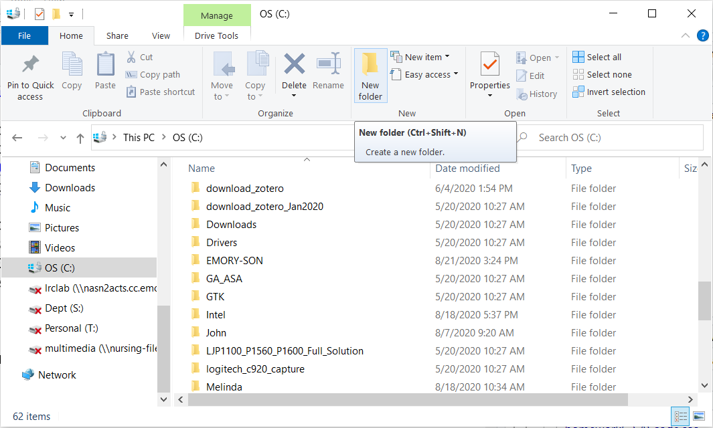

Type in name of folder

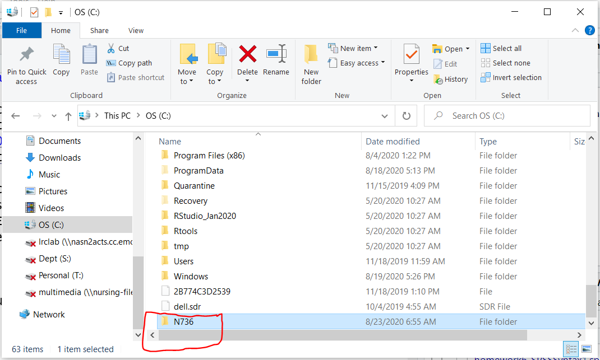

Repeat again for subfolder. 

On Windows, click at top to get full path name.

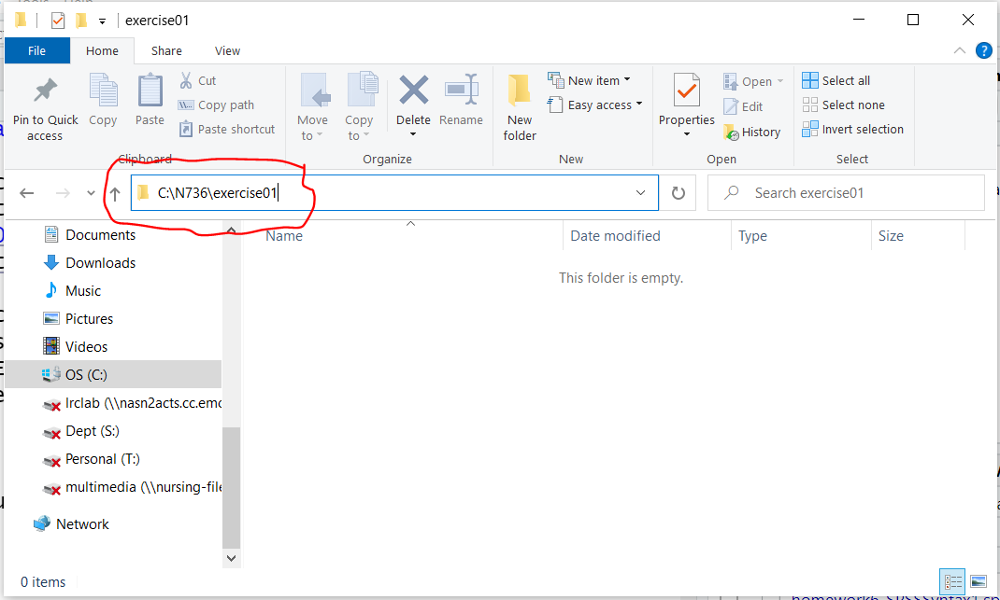

2. Now put the data file you just downloaded [Dataset_02_fixq2.csv](https://github.com/melindahiggins2000/N736Homework01/raw/master/Dataset_02_fixq2.csv) into this folder. This will be the folder you use for ALL files associated with this exercise.

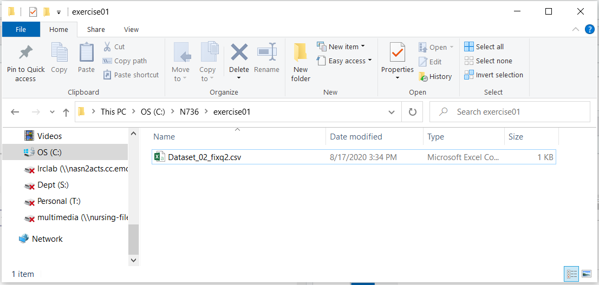

3. Follow this process for ALL of your exercises, homeworks and project(s). This will help you stay organized and avoid file location problems with software. Most software assumes that the files you are inoutting, using and saving are in this project folder. 

-----

    * R projects (should) always start with defining your project folder [File/New Project]
    
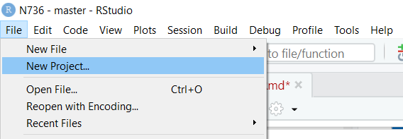

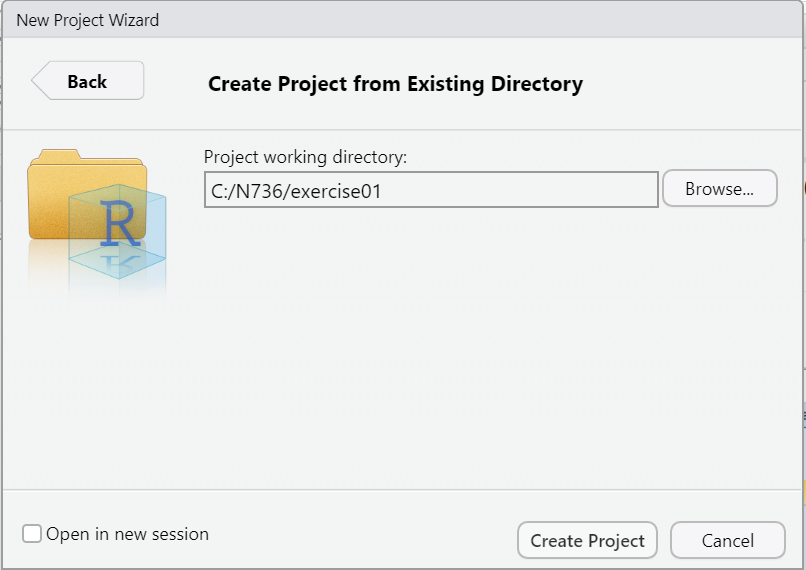

-----
    
    * SAS begins by defining a library using a `libname` statement
    
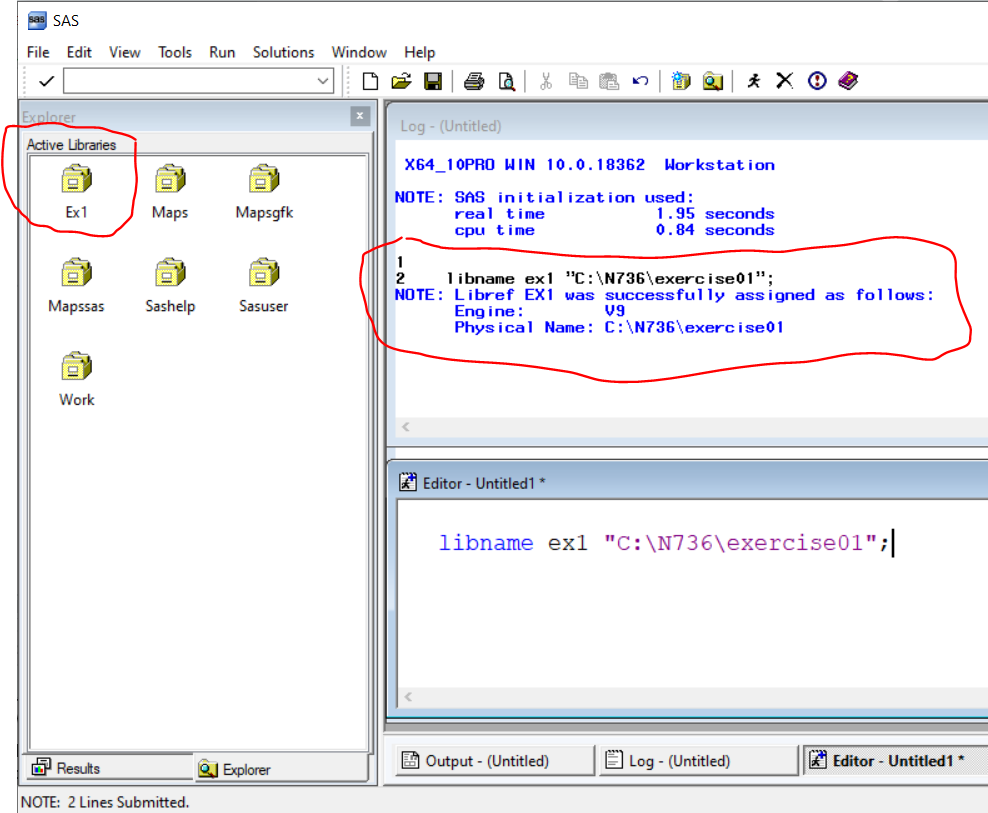

-----

    * SPSS is the most flexible. It typically defaults to remembering which folder you were in when you last exited the software. 
    * Go to EDIT/OPTIONS and choose "File Locations" TAB
    
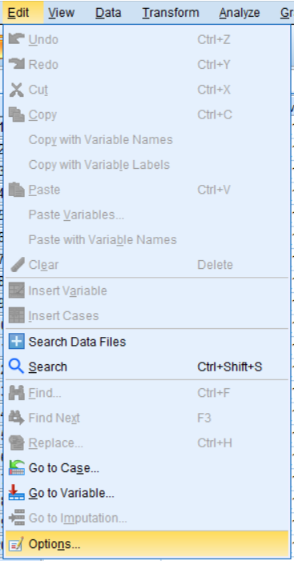

You can either keep the "Last Folder Used" default setting or go ahead and override this setting and put in your project folder path in the "Specified folder" for Data files and Other files. You need to do this AT THE BEGINNING and REDO for every new project.

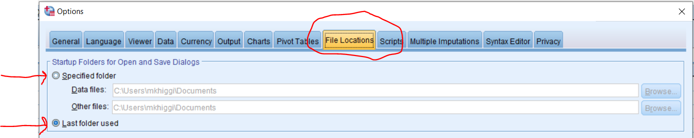

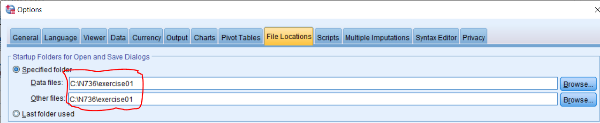

## IMPORT CSV Data into your software

-----

**`SPSS`**

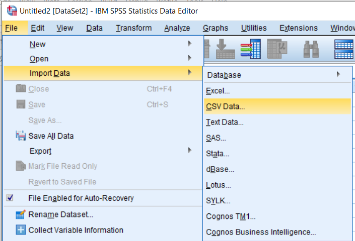

Follow the steps in the wizard. Click "PASTE" to save the SYNTAX for importing this datafile.

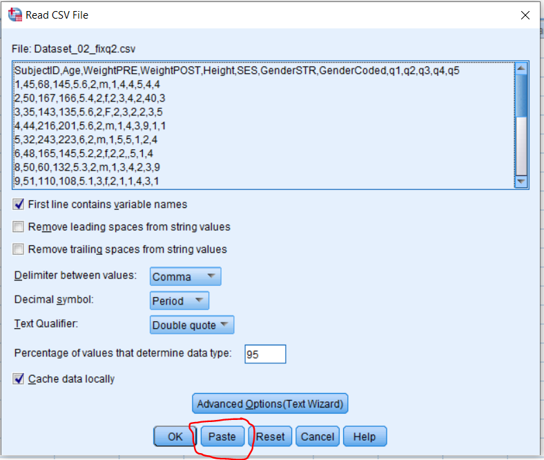

-----

**`SAS`**

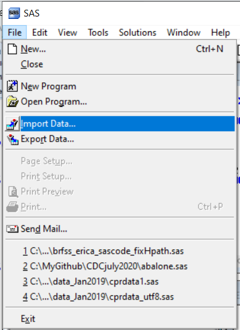

Follow the steps in the wizard. At the end you have the option to save the SAS (program) which will save the code for importing this dataset.

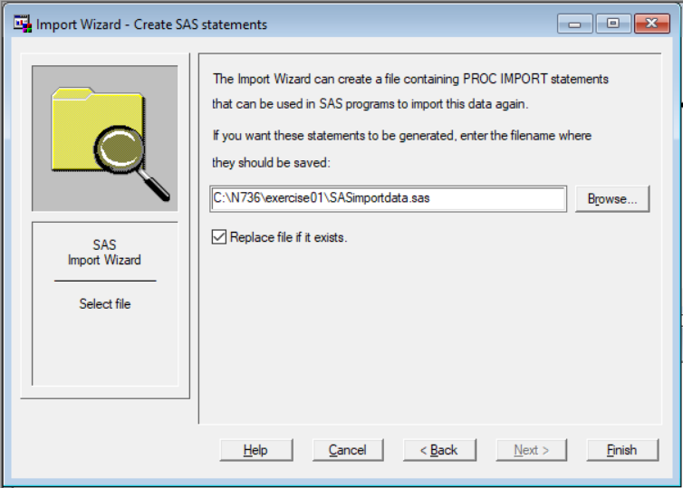

-----

**`R`**

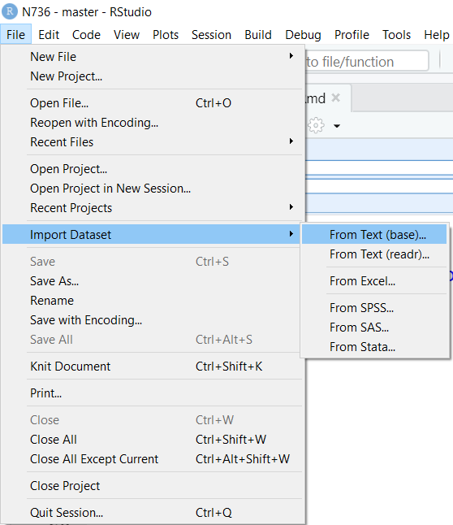

You can choose either the base or readr options:

`base` R import:

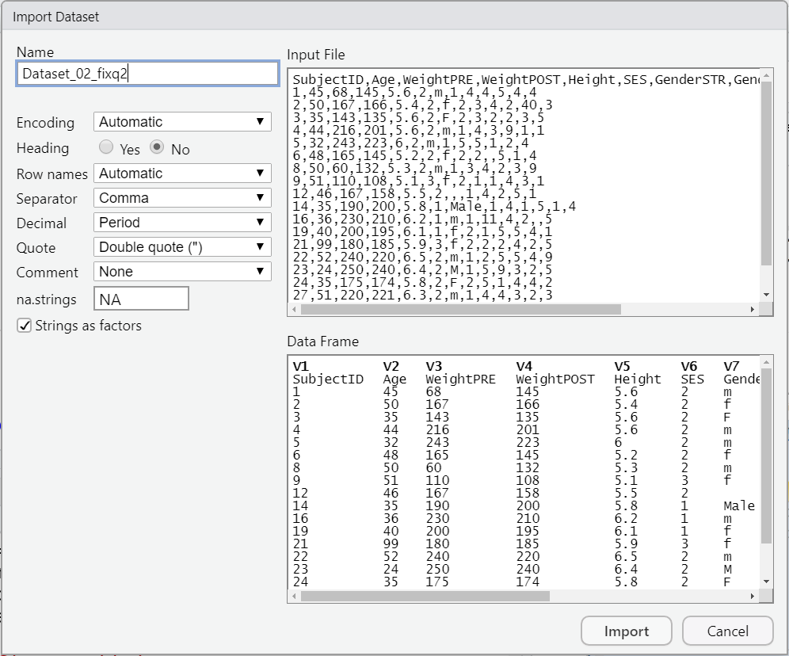

After clicking IMPORT you can see the R code run for this import in the CONSOLE window. You can save this code for future use as needed.

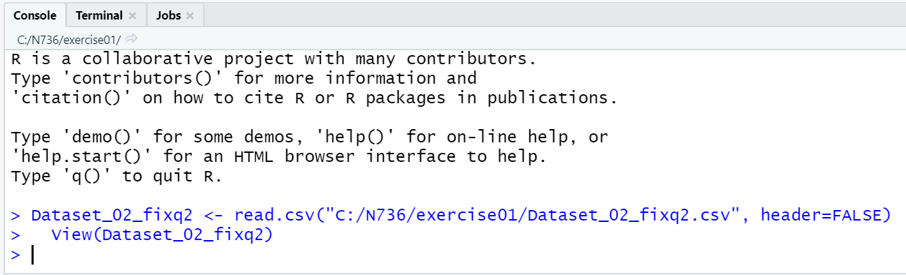

`readr` package (tidyverse) import:

The R code for this import is shown in the CODE PREVIEW at the bottom right - you can cut and paste this code to save for future use.

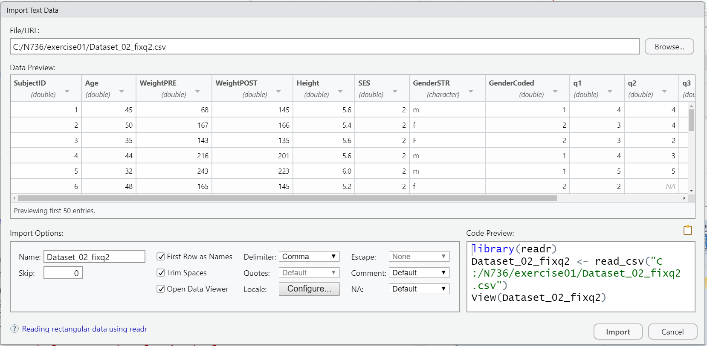

## Previous Notes - Reviewing the dataset - for Homework 01

In today's class we'll get started exploring and finding the issues and problems with the dataset you'll be working with for Homework 01. See Homework 1 instructions.

**NOTES from Class Today** [homework1_notes.txt](homework1_notes.txt)

## ALL Class discussions and videos

All classes will be recorded and the video posted at the **EchoALP** link on Canvas for NRSG 736.

Weblinks to be discussed during class:

* Journal of Biostatistics - author guidelines for "Reproducible Research" [https://academic.oup.com/biostatistics/pages/General_Instructions](https://academic.oup.com/biostatistics/pages/General_Instructions).

* Washington Post Article on "An Alarming Number of Scientific Papers Contain Excel Errors" [https://www.washingtonpost.com/news/wonk/wp/2016/08/26/an-alarming-number-of-scientific-papers-contain-excel-errors/?utm_term=.8ec47ce8bc16](https://www.washingtonpost.com/news/wonk/wp/2016/08/26/an-alarming-number-of-scientific-papers-contain-excel-errors/?utm_term=.8ec47ce8bc16).

* Genome Biology 2016 Paper on "Gene name error are widespread in the scientific literature" [https://genomebiology.biomedcentral.com/articles/10.1186/s13059-016-1044-7](https://genomebiology.biomedcentral.com/articles/10.1186/s13059-016-1044-7).

* "The Excel Error heard Around the World" [https://newrepublic.com/article/112951/rogoff-reinhart-and-world-excel-error-research](https://newrepublic.com/article/112951/rogoff-reinhart-and-world-excel-error-research) & more at [http://nymag.com/daily/intelligencer/2013/04/grad-student-who-shook-global-austerity-movement.html](http://nymag.com/daily/intelligencer/2013/04/grad-student-who-shook-global-austerity-movement.html).

* "How Bright Promise in Cancer Testing Fell Apart" - Duke cancer trials controversy [http://www.nytimes.com/2011/07/08/health/research/08genes.html?mcubz=1](http://www.nytimes.com/2011/07/08/health/research/08genes.html?mcubz=1) & "An array of errors" [http://www.economist.com/node/21528593](http://www.economist.com/node/21528593).

* "A Manifesto for Reproducible Science" [https://www.nature.com/articles/s41562-016-0021](https://www.nature.com/articles/s41562-016-0021).

* Center for Open Science [https://cos.io/](https://cos.io/) & COS History [https://cos.io/about/brief-history-cos-2013-2017/](https://cos.io/about/brief-history-cos-2013-2017/).

* Science "One in Five Genetics Papers Contains Errors Thanks to Microsoft Excel" [http://www.sciencemag.org/news/sifter/one-five-genetics-papers-contains-errors-thanks-microsoft-excel](http://www.sciencemag.org/news/sifter/one-five-genetics-papers-contains-errors-thanks-microsoft-excel).

## Other links you might want to explore

* Gitbook [https://www.gitbook.com/](https://www.gitbook.com/).

* Bookdown [https://bookdown.org](https://bookdown.org).

* Yihui Xie's book on the `bookdown` package [https://bookdown.org/yihui/bookdown/](https://bookdown.org/yihui/bookdown/).

* Github repo for Yihui Xie's "Dynamic Documents with R and knitr" - 1st 3 chapters available online  [https://github.com/yihui/knitr-book](https://github.com/yihui/knitr-book).

* Garrett Grolemund and Hadley Wickham's book "R for Data Science" - also online at [http://r4ds.had.co.nz/](http://r4ds.had.co.nz/) & if you're interested, here is the Github repo for their book [https://github.com/hadley/r4ds](https://github.com/hadley/r4ds).

* Tidyverse [https://www.tidyverse.org/](https://www.tidyverse.org/).

